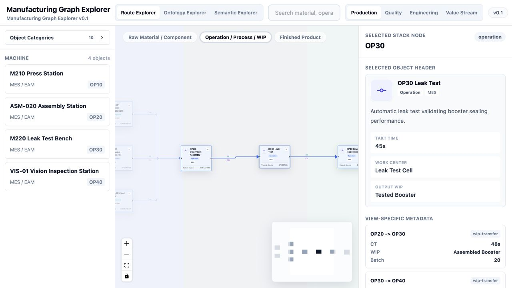
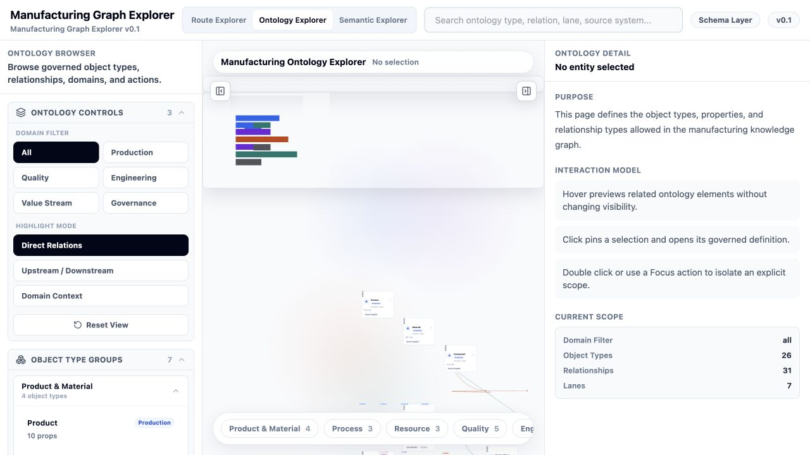
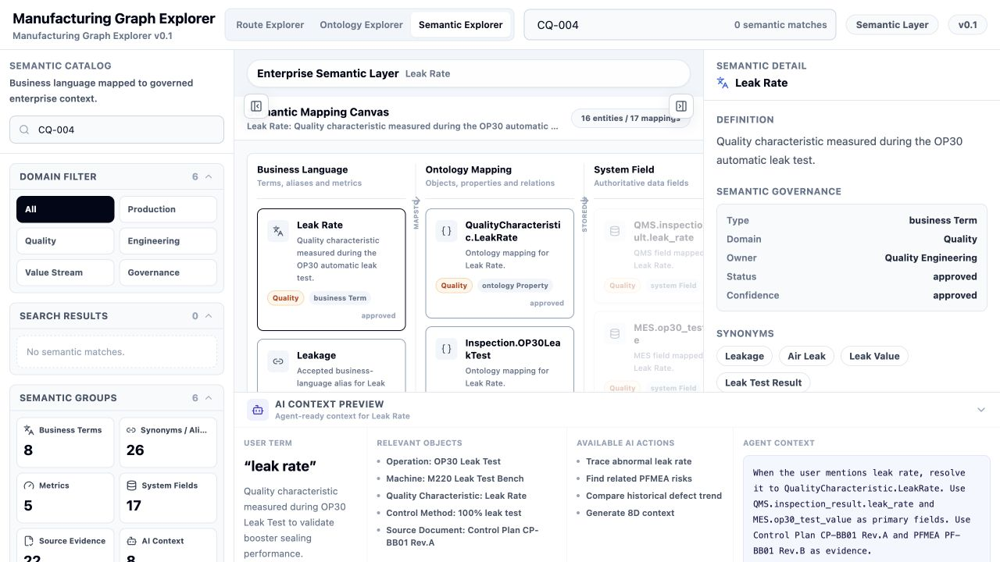

# Manufacturing Knowledge Graph Explorer

An enterprise knowledge engineering prototype that combines a management-facing manufacturing Demo with Ontology-as-Code, SHACL, data contracts, source mappings, rules, competency queries, validation, and release automation.

## Vision and Boundary

The repository demonstrates how manufacturing knowledge can be defined, validated, explained, and presented before a production knowledge platform is connected to MES, QMS, PLM, DMS, or ERP.

> 前端 Demo 是企业知识工程蓝图的展示层和交互验证层，
> 不是业务知识的权威存储系统。
>
> Git 管理企业如何定义、解释和展示知识；
> 运行时知识图谱和源系统管理现实世界中的事实及其有效时间。

The current Demo remains the **Management & Validation Experience Layer** and **Product Interaction Reference**. The deterministic pilot now includes optional Neo4j graph retrieval, governed local document ingestion/retrieval, persisted Agent sessions/audit, SSE run streaming, a server-derived authorization baseline, and governed synchronization of controlled local MES/QMS/PLM extracts. Enterprise OIDC acceptance, live enterprise source connectivity, vector retrieval, OpenAI live acceptance, and production-grade multi-process persistence remain outside the present scope.

## Implemented Pages

- **Route Explorer**: left-to-right manufacturing flow with Production, Quality, Engineering, and Value Stream views, stack nodes, edge metadata, Focus Mode, search, detail panels, and one-hop highlighting.
- **Ontology Explorer**: object types, properties, relationships, domains, search, focus, highlighting, and detail inspection.
- **Semantic Explorer**: business terms, aliases, ontology mappings, system fields, evidence, and agent-ready context across five semantic lanes.
- **Agent Demo**: Scripted Demo by default, with an optional Agent API mode backed by constrained semantic parsing, evidence-grounded template/LLM answer composition, deterministic citation publication gates, persistent sessions, SSE stage updates, replay, and controlled retry.

Page-level URLs preserve the active Explorer and supported view, selection, scenario, query, and focus state. The legacy root entry remains compatible, while routes such as `/routes/quality`, `/ontology/classes/Operation`, and `/semantic/scenarios/machine-impact-analysis` can be opened directly and restored with browser Back/Forward.

## Explorer Screenshots

### Route Explorer

The Route Explorer presents the manufacturing route as a structured left-to-right digital thread. Production, Quality, Engineering, and Value Stream modes reuse the same process topology while changing stack-node priorities and edge metadata. Search, one-hop highlighting, Focus Mode, stack expansion, and the detail panel support investigation without losing process context.



Direct entry: `/routes/production`

### Ontology Explorer

The Ontology Explorer exposes the governed object model behind the Demo: classes, properties, relationship types, domains, and source-system alignment. Domain filters and direct, upstream/downstream, or domain-context highlighting help users inspect how manufacturing, equipment, quality, value-stream, and governance concepts connect.



Direct entry: `/ontology` or `/ontology/classes/Operation`

### Semantic Explorer

The Semantic Explorer connects business language to ontology elements, authoritative system fields, source evidence, and agent-ready context. The screenshot shows the CQ-004 machine-impact scenario resolving **Leak Rate** with quality governance, mappings, related objects, evidence, and available AI actions.



Direct entry: `/semantic/scenarios/machine-impact-analysis`

## Technology

- React 18 and TypeScript 5.7
- Vite 6
- React Flow 11
- Tailwind CSS 3
- npm workspaces
- Python 3.11+, RDFLib, pySHACL, JSON Schema, and PyYAML for knowledge validation

## Repository Structure

```text
src/                              Existing frontend Demo
src/repositories/                 Repository interface adapters and legacy fixture entry
packages/knowledge-contracts/     Shared TypeScript and JSON Schema contracts
packages/demo-data/               Contract-aligned graph, ontology, semantic, and scenario fixtures
packages/ontology-client/         Future HTTP repository client
packages/agent-core/              Deterministic provider-neutral Agent pipeline
packages/document-evidence/       Governed deterministic document ingestion and retrieval
packages/agent-evaluation/        Versioned evaluation, observability, regression, and release gates
packages/neo4j-repository/        Server-only Neo4j KnowledgeRepository pilot adapter
packages/source-sync/             Governed source connector, mapping, checkpoint, and sync boundary
ontology/                         Core, domain, and application OWL/Turtle modules
shapes/                           SHACL constraints
mappings/                         MES, QMS, PLM, and Demo alignment mappings
rules/                            Governed SPARQL rules
queries/                          Competency and diagnostic SPARQL queries
examples/                         Valid and intentionally invalid RDF instances
reference-data/                   Governed example code lists
migrations/                       Ontology migration records
scripts/                          Validation, query, documentation, and release tooling
tests/                            Frontend and integration regression tests
services/agent-api/               Deterministic HTTP Agent API, SSE runs, and file persistence
docs/                             Architecture, governance, API, and roadmap documentation
.github/workflows/                Frontend, integration, and release CI
```

The frontend intentionally remains at repository root. Moving it to `apps/knowledge-explorer-demo` is deferred to avoid destabilizing the current commands, static deployment, and presentation baseline. See [ADR 0001](docs/adr/0001-preserve-root-demo.md).

## Getting Started

Recommended runtime: Node 20 LTS or 22+ and Python 3.11+.

```bash
make install
make demo-dev
```

Existing commands remain valid:

```bash
npm install
npm run dev
npm run build
npm run preview
```

Run the deterministic Agent API mode in two terminals:

```bash
npm run agent-api:dev
npm run dev:agent
```

The optional Neo4j pilot is documented in [Phase 3B - Neo4j Knowledge Repository](docs/phase-3b-neo4j-repository.md). SSE and persistent-session behavior is documented in [Phase 3C - SSE Streaming and Persistent Sessions](docs/phase-3c-sse-persistence.md). Mock retrieval remains the default.

The constrained semantic parser modes are documented in [Phase 4A - LLM Semantic Parser](docs/phase-4a-llm-semantic-parser.md). Deterministic parsing remains the default; enabling an LLM requires explicit server-only provider configuration.

Evidence-grounded answer generation is documented in [Phase 4B - Evidence-Grounded LLM Answer Composer](docs/phase-4b-evidence-grounded-answer-composer.md). Template composition remains the default.

The provider-neutral OpenAI/DeepSeek boundary and separate live acceptance are documented in [Phase 4A/4B Provider Extension - DeepSeek Adapter](docs/phase-4-provider-deepseek-extension.md). DeepSeek uses its native Chat Completions API; deterministic and template modes remain the defaults.

Governed chunk-level document evidence is documented in [Phase 4C - Governed Document Evidence](docs/phase-4c-governed-document-evidence.md). The controlled fixtures are deterministic demo data; no enterprise files, OCR, embeddings, or vector database are connected.

## Validation and Tests

```bash
make validate          # ontology, SHACL, mappings, contracts, Demo alignment, competency queries
make test              # lint, typecheck, Vitest, competency queries
make demo-build        # production frontend bundle
make build             # complete validated release package
```

Individual checks:

```bash
make ontology-validate
make shapes-validate
make mappings-validate
make contracts-validate
make competency-test
make mock-api-test
npm run lint
npm run typecheck
npm run test
npm run agent-api:test
npm run documents:verify
npm run agent:evaluate
npm run security:acceptance
npm run source-sync:acceptance
npm run openai:acceptance
npm run deepseek:acceptance
```

Phase 5A evaluation is documented in [Agent Evaluation, Observability and Release Gates](docs/phase-5a-agent-evaluation-observability.md). The deterministic local gate is independent of real provider smoke acceptance. DeepSeek Semantic, Answer, and full-pipeline acceptance passed independently with `fallbackUsed: false`; OpenAI acceptance remains pending.

Phase 5C security controls are documented in [Production Security and Authorization](docs/phase-5c-production-security-authorization.md). Static Bearer authentication is a controlled acceptance adapter; enterprise OIDC/JWKS and IAM mapping remain explicitly pending.

Phase 5D governed source synchronization is documented in [Source-system Connectors and Governed Data Synchronization](docs/phase-5d-source-connectors-governed-sync.md). The validated adapters read controlled local extracts with exact mappings and checkpoints; live enterprise endpoints and credentials remain pending.

SHACL valid fixtures must pass and files under `examples/invalid` must fail. Frontend payloads are separately checked against JSON Schema; neither validation replaces the other.

## Data and Contracts

- Runtime legacy fixtures: `src/data/` and `src/features/semantic/semanticData.ts`.
- Unified compatibility entry: `src/repositories/legacyDemoData.ts`.
- Default adapter: `src/repositories/MockKnowledgeRepository.ts`.
- HTTP API adapter: `packages/ontology-client`.
- Independent local service: `services/mock-knowledge-api`.
- Shared contracts: `packages/knowledge-contracts`.
- Contract-aligned API fixtures: `packages/demo-data`.

Migration is incremental. Stable page components continue to receive existing structures while repository adapters expose `KnowledgeEntity`, `KnowledgeRelation`, `GraphNode`, `GraphEdge`, ontology, Semantic Catalog, and semantic-search contracts.

## Extending the Knowledge Model

### Add an Ontology Class or Property

1. Select the owning module and namespace.
2. Add the OWL term with label, definition, domain/range, and version impact.
3. Add or update SHACL where instance constraints are required.
4. Update mappings, valid and invalid examples, and migration notes.
5. Add a competency query or update an existing one.
6. Run `make validate`.

### Add a Demo Entity Type

1. Decide whether it is a formal domain concept or only a View Model label.
2. Add the contract type or visual model in the correct layer.
3. Add its alignment to `mappings/demo-type-mappings.yaml` when a legacy label is required.
4. Add a contract fixture and run `make contracts-validate` plus frontend tests.

### Add a Graph Scenario

1. Add contract-aligned data under `packages/demo-data/graph`.
2. Add scenario metadata under `packages/demo-data/scenarios`.
3. Reuse stable IDs and declared ontology terms.
4. Add repository or UI regression coverage.

### Add a Competency Question

1. Add a SPARQL file under `queries/competency`.
2. Register it in `queries/competency/catalog.yaml`.
3. Link it to a Demo scenario and logical frontend page.
4. Ensure valid example data returns at least one expected result.
5. Run `make competency-test`.

## Release and Versions

Versions are independent:

- Demo App: `0.1.0`
- Ontology: `1.1.0`
- Demo Dataset: `0.5.0`
- Knowledge Contract: `1.1.0`

`make build` creates:

```text
dist/
  frontend-demo/
  ontology-release/
  demo-data/
  contracts/
  manifest.json
  checksums.txt
```

The frontend bundle is static and can be served by GitHub Pages, Nginx, an internal static server, or an offline presentation host. The full release manifest records versions, Git commit, build time, and packaged files.

## Documentation

- [Architecture](docs/architecture.md)
- [Frontend Demo positioning](docs/frontend-demo-positioning.md)
- [Demo to production roadmap](docs/demo-to-production-roadmap.md)
- [Modeling principles](docs/modeling-principles.md)
- [API contracts](docs/api-contracts.md)
- [Versioning policy](docs/versioning-policy.md)
- [Governance](docs/governance.md)
- [Temporal modeling](docs/temporal-modeling.md)
- [Mapping guidelines](docs/mapping-guidelines.md)
- [Local development](docs/local-development.md)
- [Repository audit baseline](docs/repository-audit.md)
- [Production deployment](DEPLOYMENT.md)

The next production step is not a frontend rewrite. It is a pilot Graph API and semantic search service that implement the shared contracts, preserve provenance and validity time, and pass the same integration validation before replacing the Mock repository.
